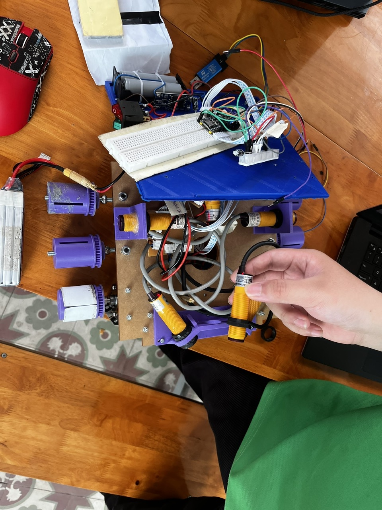

[DA_VXL.md](https://github.com/user-attachments/files/31110626/DA_VXL.md)
# Đồ án Vi xử lý: Giám sát & Điều khiển Sumo Robot (DA_VXL)

Tài liệu này mô tả chi tiết kiến trúc và các thành phần của hệ thống dự án Sumo Robot. Dự án bao gồm hai phần chính: Hệ thống điều khiển (Firmware chạy trên STM32) và Hệ thống giám sát (Webserver/App chạy trên Python/PC).

## 1. Tổng quan Kiến trúc

- **`stm32_workspace/sumo_robot_CE103`**: Mã nguồn nhúng (C/C++) phát triển trên nền tảng STM32CubeIDE cho vi điều khiển STM32F4. Phụ trách đọc các cảm biến (dò vạch, hồng ngoại), ra quyết định theo các trạng thái (Finite State Machine) để điều khiển động cơ và gửi telemetry về máy chủ giám sát.
- **`webserver_esp32/sumo_robot_CE103`**: Trạm giám sát nhận dữ liệu từ robot (dưới dạng chuỗi JSON) và hiển thị trực quan lên giao diện web theo thời gian thực (Real-time dashboard).

---

## 2. Chi tiết Thành phần Firmware (STM32 Workspace)

Hệ thống điều khiển được cấu trúc hướng đối tượng (OOP trong C) thông qua các thư viện phần cứng tùy chỉnh đặt tại thư mục `Hardware`.

### 2.1. Cấu hình Phần cứng (Hardware Drivers)
* **Motor (`Motor.h`, `Motor.c`)**: Quản lý 2 bánh xe (trái, phải). Sử dụng Timer (TIM2) để xuất xung PWM điều khiển tốc độ và các chân GPIO để chỉnh chiều quay.
* **TCRT5000 (`TCRT5000.h`, `TCRT5000.c`)**: Mảng 5 cảm biến dò vạch (Line Sensor) được đọc qua tín hiệu Digital (0/1). Giúp robot nhận diện vạch giới hạn của sàn đấu (tránh rớt đài).
* **E3F (`E3F.h`, `E3F.c`)**: Mảng 6 cảm biến vật cản hồng ngoại (Distance Sensor) đặt xung quanh robot để phát hiện đối thủ.

### 2.2. Thuật toán Cốt lõi (`main.c`)
Robot hoạt động dựa trên máy trạng thái (State Machine) với 5 trạng thái:
1. **`STATE_SURVIVAL` (Sinh tồn)**: Ưu tiên cao nhất. Kích hoạt khi mảng dò vạch TCRT5000 phát hiện mép sàn, robot sẽ lùi hoặc xoay để không bị rơi khỏi sàn.
2. **`STATE_ATTACK` (Tấn công)**: Khi phát hiện đối thủ ở phía trước mặt (cảm biến E3F phía trước 1, 2, 3), robot sẽ lao thẳng tới để đẩy đối thủ.
3. **`STATE_DEFENSE` (Phòng thủ)**: Khi phát hiện đối thủ đang tiếp cận từ hai bên hoặc phía sau (cảm biến E3F 0, 4, 5), robot xoay người để phản công hoặc né tránh.
4. **`STATE_SEARCH` (Tìm kiếm)**: Khi không phát hiện đối thủ và không chạm vạch, robot sẽ đi tuần tự để tìm kiếm.
5. **`STATE_WAITING` (Chờ)**: Trạng thái dừng khi robot mới khởi động, có thời gian chờ (delay 4.5s ban đầu theo chuẩn thi đấu Sumo).

* **Anti-stall (Chống kẹt)**: Tích hợp logic tự giải cứu nếu phát hiện động cơ không quay trong 2 giây liên tục bằng cách lùi và xoay.
* **Đẩy Telemetry**: Định kỳ mỗi 100ms hoặc khi có sự thay đổi trạng thái lập tức đẩy gói tin JSON qua chuẩn UART (USART1). Format:
  `{"type": "telemetry", "line": [1,0,0,0,1], "e3f": [0,0,1,0,0,0], "motor_l": 1000, "motor_r": 1000}`

---

## 3. Chi tiết Trạm Giám sát (Webserver/Python Workspace)

Phần mềm giám sát được viết bằng Python, sử dụng Flask, SocketIO, và Tkinter. Dữ liệu từ Robot truyền qua UART có thể được một module ESP32 (cầu nối Wifi) truyền vào TCP Server.

### 3.1. Các script Python
* **`app.py`**: Chạy đồng thời 2 server. 
  - *TCP Server* (Port 5001) để lắng nghe chuỗi JSON từ thiết bị phần cứng.
  - *Flask SocketIO Server* (Port 5000) để host trang web và realtime đẩy dữ liệu sensor từ TCP server xuống trình duyệt.
* **`server.py`**: Ứng dụng Desktop UI đơn giản bằng `Tkinter` (Thiết kế giống Hercules Raw Console). Dùng để test và nhận raw text truyền từ robot nhằm mục đích debug thuần túy (lắng nghe ở TCP Port 5000).
* **`client.py`**: Script test. Đóng vai trò làm Robot để generate dữ liệu JSON ngẫu nhiên liên tục và đẩy vào `app.py` để test giao diện web mà không cần có mạch STM32 thực tế.

### 3.2. Giao diện người dùng (`templates/index.html`)
Giao diện dashboard hiện đại với màu sắc tối (Dark Theme), chứa một ảnh động vẽ bằng thẻ `<svg>` thể hiện nguyên dạng chiếc Sumo Robot nhìn từ trên xuống:
* **Bánh xe (Motor)**: Sẽ nhấp nháy phát sáng xanh lá (`#00ff00`) khi nhận thấy thông số motor quay từ backend.
* **Cảm biến hồng ngoại (E3F)**: Có 6 chấm tròn bao quanh, khi chướng ngại vật lại gần nó sẽ phát sáng viền đỏ (`#ff3e3e`).
* **Cảm biến vạch (Line)**: Có 5 chấm vuông, phát sáng vàng (`#ffff00`) khi đè lên vạch trắng.
* **Văn bản trạng thái**: Đọc Text log từ SocketIO để hiển thị rõ chữ thể hiện trạng thái tức thời (ATTACK đỏ, SURVIVAL vàng, DEFENSE cam, SEARCH xanh lam) nằm giữa thân robot.

---

## 4. Hình ảnh và Video Minh chứng

### Hình ảnh Robot

### Video Hoạt động
<video width="100%" controls>
  <source src="1786840896051_53776763891348135_3206772400995361176.mp4" type="video/mp4">
  Trình duyệt/Trình đọc của bạn không hỗ trợ thẻ video.
</video>
